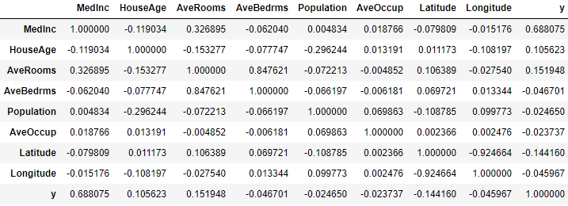

The libraries I used for test corrections were as follows 

```python
import pandas as pd 
import math as md
import numpy as np
import matplotlib.pyplot as plt
from sklearn.linear_model import LinearRegression as LR
from sklearn.linear_model import Ridge
from sklearn.model_selection import KFold
import seaborn as sns

from sklearn.datasets import fetch_california_housing
```

**Assigned Variables** 

```python
X = data.data
X_names = data.feature_names
X_df = pd.DataFrame(data = X, columns=X_names)
y = data.target
y_names = data.target_names
```

**#15** 

To do this problem all I did was simply use 

```python
np.corrcoef(X_df['MedInc'], y)
```

I did this for all the variables that I had to compare with and found MedInc having the strongest correlation which was 0.68807521

I later learned with corrections and importing StandardScaler that there was a better way to do that. I did that as follows. 

```python
Xs = ss.fit_transform(X)
Xs_df = pd.DataFrame(Xs, columns = X_names)
Xsy_df = Xs_df.copy()
Xsy_df['y'] = y
Xsy_df.corr()
```

The data frame looked like below 



The above graph is almost like a heatmap without the colors. Obviously a heatmap can be used to measure the strength of a correlation by color, but I found this way easier when finding which variables have the strongest and weakest correlations. 

**#16** 

After standardizing the data and inputting the code 

```python
np.corrcoef(Xs_df['MedInc'], y)
```

The correlations stayed the same after standardizing. 

**17** 

To find the coefficient of determination I ran the following code. 

```python
 np.round(np.corrcoef(X_df['MedInc'], y)[0][1]**2,2)
```

I was able to get a value of .47 

**#18**

When creating the DoKFold speaking and class and going through the code slower I realized one of my largest problems I had was I was trying to do to much at once. I made two different KFold functions, one for regression and the other one for MSE. Making things that more complicated increases the chance of making a simple typing mistake when creating your code. 

The new upgraded DoKFold code is below 

```python
def DoKFold(model, X, y, k, standardize=False, random_state=146):
    import numpy as np
    from sklearn.model_selection import KFold
    kf = KFold(n_splits=k, shuffle=True, random_state=random_state)
    if standardize:
        from sklearn.preprocessing import StandardScaler as SS
        ss = SS()
    train_scores = []
    test_scores = []

train_mse = []
test_mse = []

for idxTrain, idxTest in kf.split(X):
    Xtrain = X[idxTrain, :]
    Xtest = X[idxTest, :]
    ytrain = y[idxTrain]
    ytest = y[idxTest]

​    if standardize:
​        Xtrain = ss.fit_transform(Xtrain)
​        Xtest = ss.transform(Xtest)

​    model.fit(Xtrain, ytrain)

​    train_scores.append(model.score(Xtrain, ytrain))
​    test_scores.append(model.score(Xtest, ytest))

​    ytrain_pred = model.predict(Xtrain)
​    ytest_pred = model.predict(Xtest)

​    train_mse.append(np.mean((ytrain-ytrain_pred) ** 2))
     test_mse.append(np.mean((ytest - ytest_pred) ** 2))

return train_scores, test_scores, train_mse, test_mse
```

As you can see above, this function is capable of find MSE and training and testing correlations 

Using this drastically made things easier. I then ran the linear regression as follows. 

```python
k = 20
train_scores, test_scores, train_mse, test_mse = DoKFold(LR(), X, y, k, True)
print(np.mean(train_scores), np.mean(test_scores))
print(np.mean(train_mse), np.mean(test_mse))
```

This result had a train score of 0.6063019182717753 and then a testing score of 0.6019800920504694

**#19** 

The ridge regression was also much easier since I did not have to readjust for MSE or change functions. The ridge regression was ran as follows. 

```python
a_range = np.linspace(20, 30, 101)
k = 20

rid_tr =[]
rid_te =[]
rid_tr_mse = []
rid_te_mse = []
for a in a_range:
    rid_reg = Ridge(alpha=a)
    train_scores,test_scores, train_mse, test_mse = DoKFold(rid_reg,X,y,k,standardize=True)
    rid_tr.append(np.mean(train_scores))
    rid_te.append(np.mean(test_scores))
    rid_tr_mse.append(np.mean(train_mse))
    rid_te_mse.append(np.mean(test_mse))

idx = np.argmax(rid_te)
print(a_range[idx], rid_tr[idx], rid_te[idx], rid_tr_mse[idx], rid_te_mse[idx])
```

The optimal alpha level was 25.8, the training score was .6062707743487987 and then a testing score of 

0.602011168741859. 

**#20** 

The lasso regression was run almost the same as the ridge regression except for the fact that the variables were different. 

```python
from sklearn.linear_model import Lasso

k = 20

las_a_range = np.linspace(0.001, 0.003, 101)

las_tr = []
las_te = []
las_tr_MSE = []
las_te_MSE = []

for a in las_a_range:
    las = Lasso(alpha = a)
    train_scores,test_scores,train_MSE,test_MSE = DoKFold(las, X, y, k, True)

las_tr.append(np.mean(train_scores))
las_te.append(np.mean(test_scores))
las_tr_MSE.append(np.mean(train_MSE))
las_te_MSE.append(np.mean(test_MSE))

idx = np.argmax(las_te)

print(las_a_range[idx], las_tr[idx], las_te[idx], las_tr_MSE[idx], las_te_MSE[idx])
```

The results came with an alpha value of 0.00186, a training score of 0.6061563795668891 and a testing score of 06021329052825213.

**#21** 

I really did not know what I was doing for 21 and even more for 22.  To start I did not use the real variable with the smallest coefficient. I assumed it came from the 5 variables given to me from #15. The real lowest coefficient was AveOccup. I also tried doing some crazy thing where I would change the code at the top when defining variables, so really I was extremely off. 

```python
lin = LR(); rid = Ridge(alpha=25.8); las = Lasso(alpha = 0.00186)
lin.fit(Xs, y); rid.fit(Xs, y); las.fit(Xs, y);
lin.coef_[5], rid.coef_[5], las.coef_[5]
```

I wish I knew it was that simple, would have saved me unnecessary stress and a not wrong answer. I also failed to standardize the data when going about this question so my answer was no where near what I needed. 

**#22** 

This was very simple since most of the work was done above. 

```python
lin.coef_[0], rid.coef_[0], las.coef_[0]
```

**#23** 

These questions also were much simpler when going over it, when applying MSE into the DoKFold custom function.

```python
idx = np.argmin(rid_te_mse)
print(a_range[idx], rid_tr[idx], rid_te[idx], rid_tr_mse[idx], rid_te_mse[idx])
```

The optimal alpha value was 26.1 

**#24** 

```python
idx = np.argmin(las_te_mse)
print(las_a_range[idx], las_tr[idx], las_te[idx], las_tr_mse[idx], las_te_mse[idx])
```

The optimal alpha levvel is 0.00184

**Takeaways**

The biggest takeaway I had from the midterm was that sometimes I made things more complicated then it needed to be. Since I did extra work that was unnecessary I made simple mistakes that could be as basic as  a typo or assigning variables the wrong way. I think I need to take a step back and look at the big picture of what I am doing before going in and just typing in code. 
