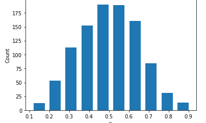
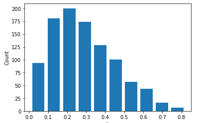
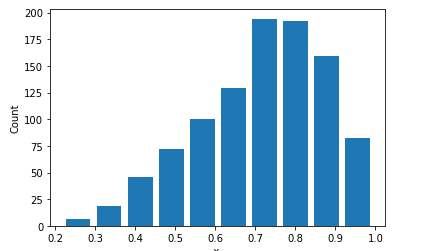
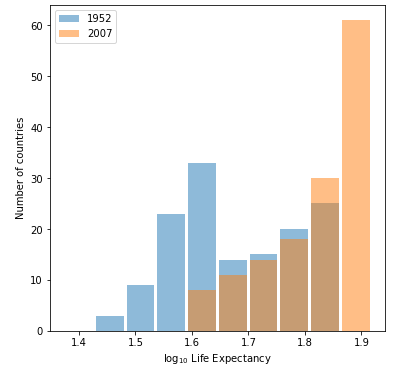
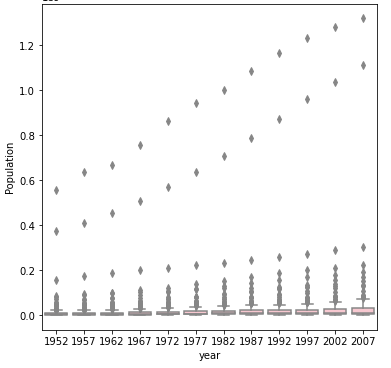
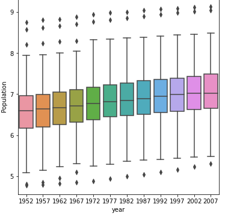

**Describe continuous, ordinal and nominal data. Provide examples of each. Describe a model of your own construction that incorporates variables of each type of data. You are perfectly welcome to describe your model using English rather than mathematical notation if you prefer. Include hypothetical variables that represent your features and target.**

Continuous data is a numerical set of data that has a range, this data can use descriptive statistics to describe the data. An example of continuous data can be test scores on an exam that range between 0-100 

Ordinal data is a numerical set of data, however the what differentiates ordinal data from continuous data  is the fact that the order of the numerical data is important. An example of ordinal data can be the results of a track and field meet, each athletes place would be the ordinal data because 1 being first place must be categorically higher then 2 which is second place. 

Nominal data  is a categorical type of data, it does not represent a numerical value however you can convert it for the purpose of a model. For example school grades can be represented as freshman, sophomore, junior or senior, however for the purpose of a model you could represent them as 1,2,3,4 respectively. 

Below is a data frame that is the results from the most recent track meet at George Mason which was held on 2/28/2021 

PL (place) would be a type of ordinal data, Year being the grade each athlete is in would be a nominal form of data, converted into numbers and Mark would be a form of continuous data. For this meet that would range from 19.05 to 0.  (foul = 0)

**Comment out the seed from your randomly generated data set of 1000 observations and use the beta distribution to produce a plot that has a mean that approximates the 50th percentile. Also produce both a right skewed and left skewed plot by modifying the alpha and beta parameters from the distribution. Be sure to modify the widths of your columns in order to improve legibility of the bins (intervals). Include the mean and median for all three plots.**

Using random seed 70 I randomly generated 1000 observation with both a beta and alpha of 5.  The mean and the median in this situation are identical sitting at a value of 0.4977330433414024. When graphing this distribution it looks like the following graph. 

When changing the alpha to 2 and keeping the beta at 5 you get a mean of 0.2875697929340264 and a median of 0.2591935039418197. Then when graphing the histogram you get the following. 

The above graph is skewed to the left. 

When keeping the alpha at 5 and changing the beta to 2 you get a mean of 0.7136018586488353 and a median of 0.7341151939531987. Below is the plotted histogram. 

The above graph is skewed to the right.

**Using the gapminder data set, produce two overlapping histograms within the same plot describing life expectancy in 1952 and 2007. Plot the overlapping histograms using both the raw data and then after applying a logarithmic transformation (`np.log10()` is fine). Which of the two resulting plots best communicates the change in life expectancy amongst all of these countries from 1952 to 2007?**

When importing the gapminder data and plotting an overlapping histogram you get the following. 

When applying logarithmic transformation to the data you get a graph that looks like the following 

When comparing the first graph and then the graph with logarithmic transformation you can notice that the graphs are relatively similar. The first graph has more outliers on the outside of the data sets.  It makes the data more skewed and the graph harder to comprehend. As you can notice between the first graph and the second graph.  In conclusion the logarithmic transformation made the graph much easier to comprehend with less confusion.

**Using the seaborn library of functions, produce a box and whiskers plot of population for all countries at the given 5-year intervals. Also apply a logarithmic transformation to this data and produce a second plot. Which of the two resulting box and whiskers plots best communicates the change in population amongst all of these countries from 1952 to 2007?**

*Without a log*

*With a log*

The box and whiskers after using a log is much easier to visualize/comprehend
